# Modelo estático de uma página de portfólio.

## Um modelo estático de um site de portfólio com exemplos de projetos inexistentes.

### Tecnologias
	- HTML
	- CSS

## Página home
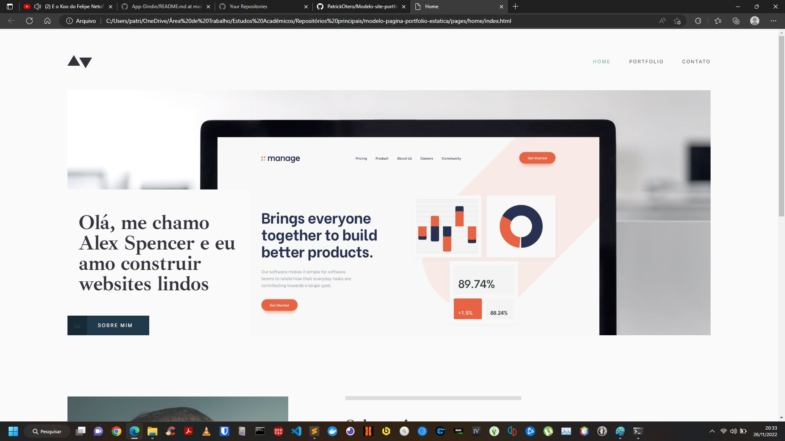
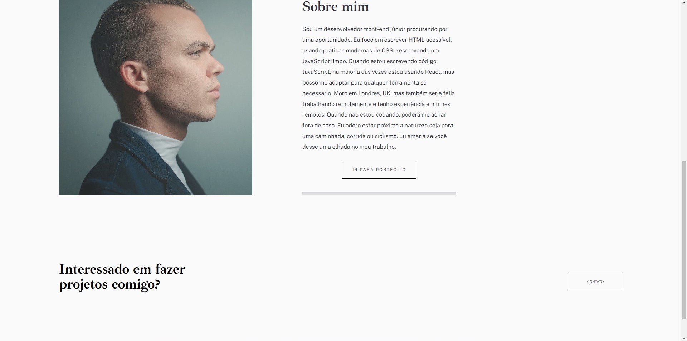

## Página de contato
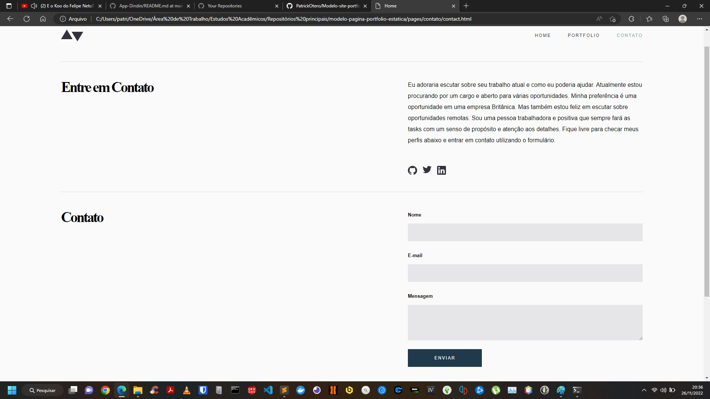

## Página de portfolio
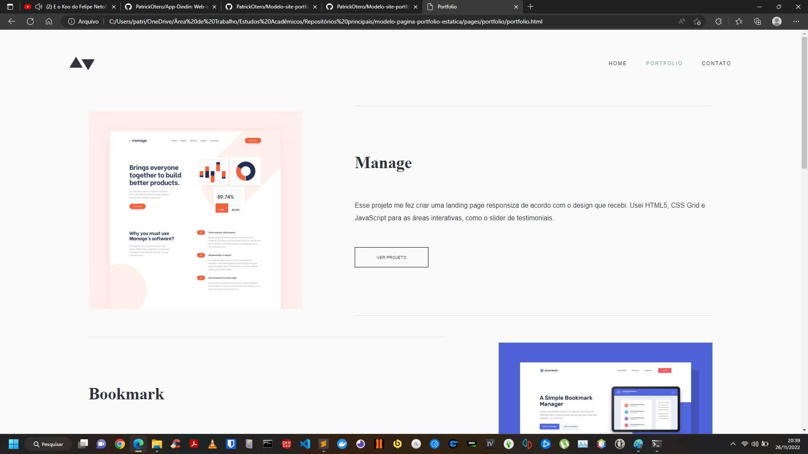
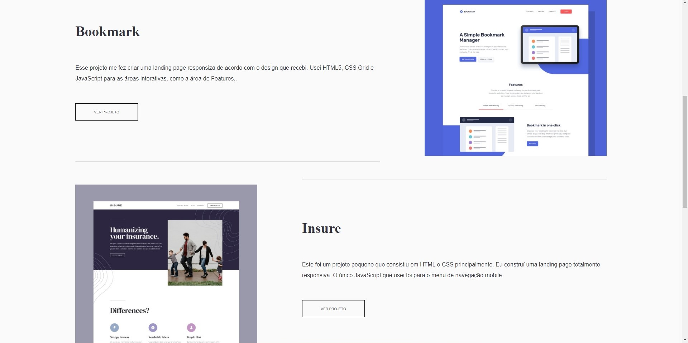
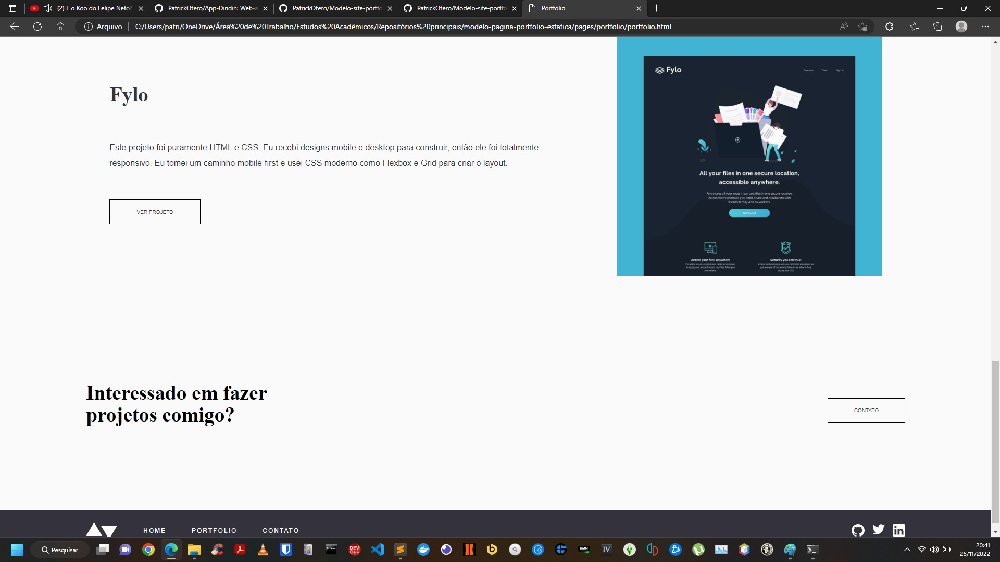

## Página "Manage"
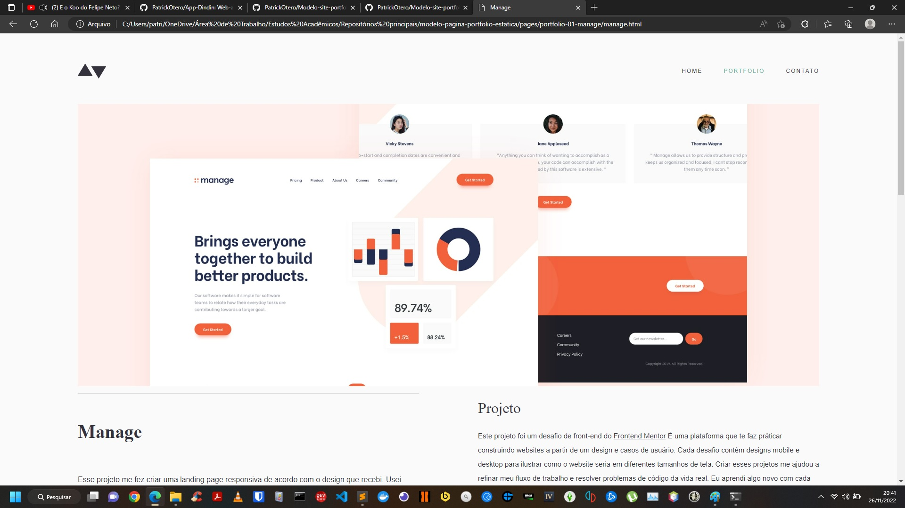
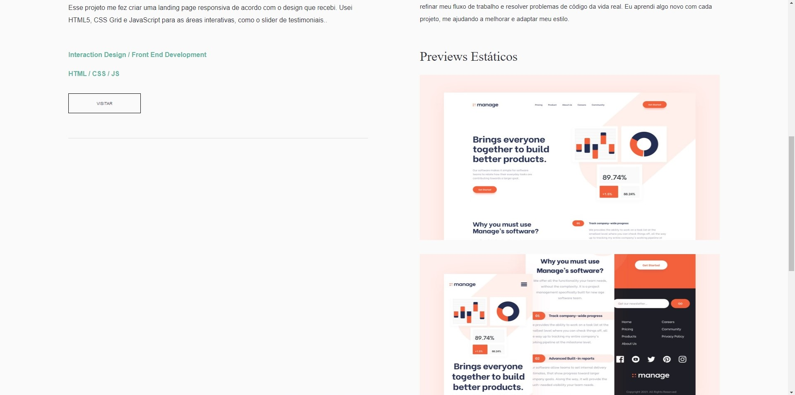
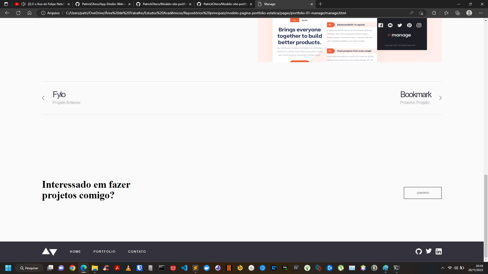

## Página "Bookmark"
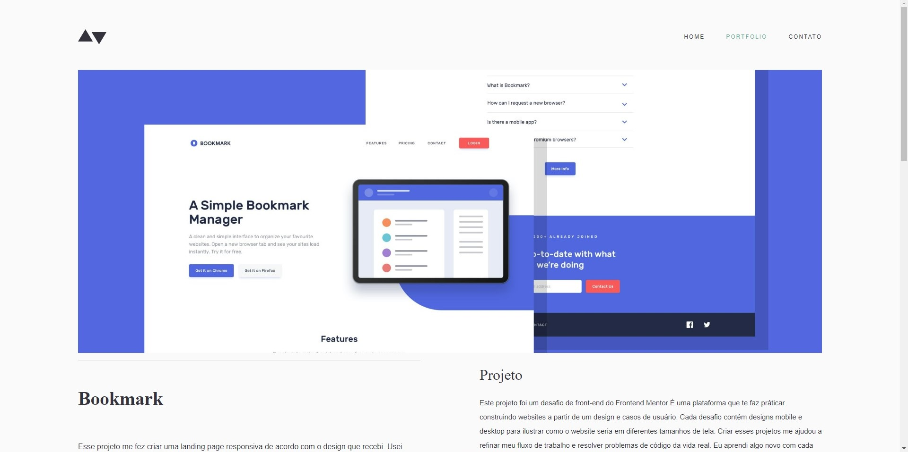
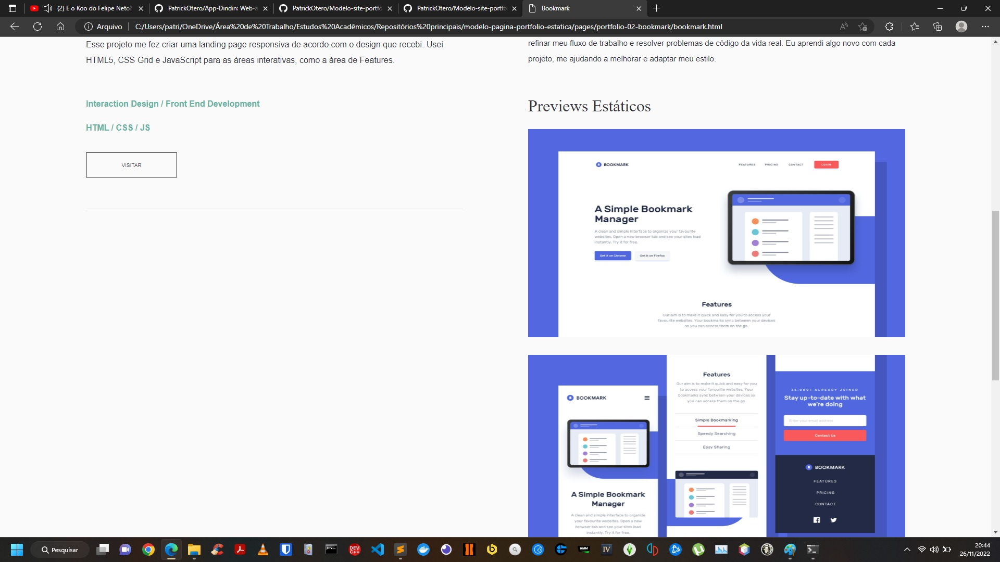
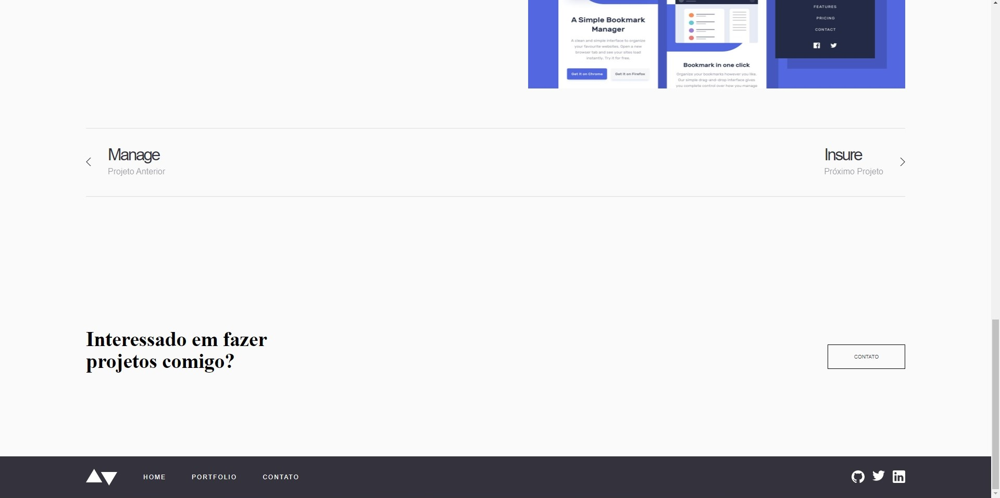

## Página "Insure"

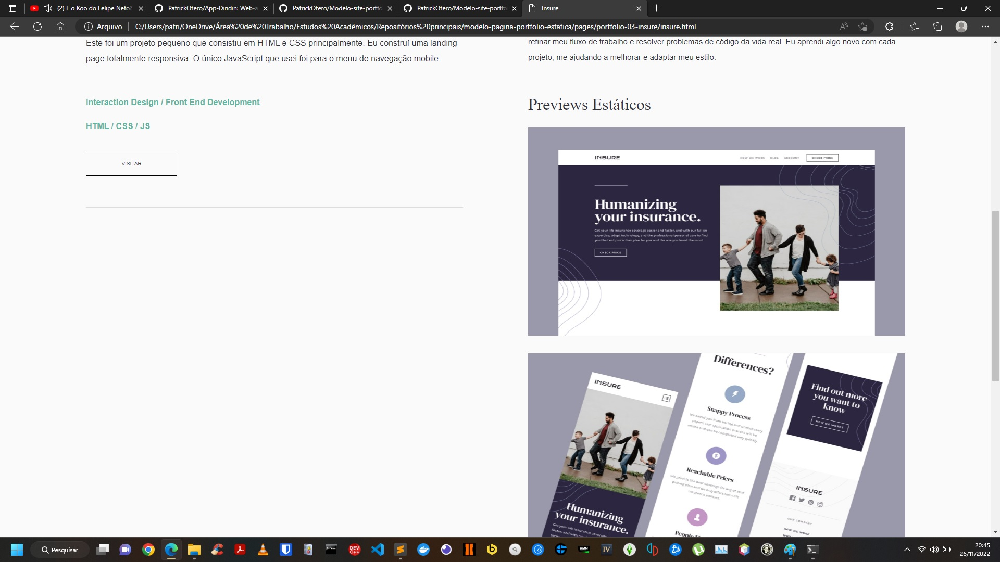
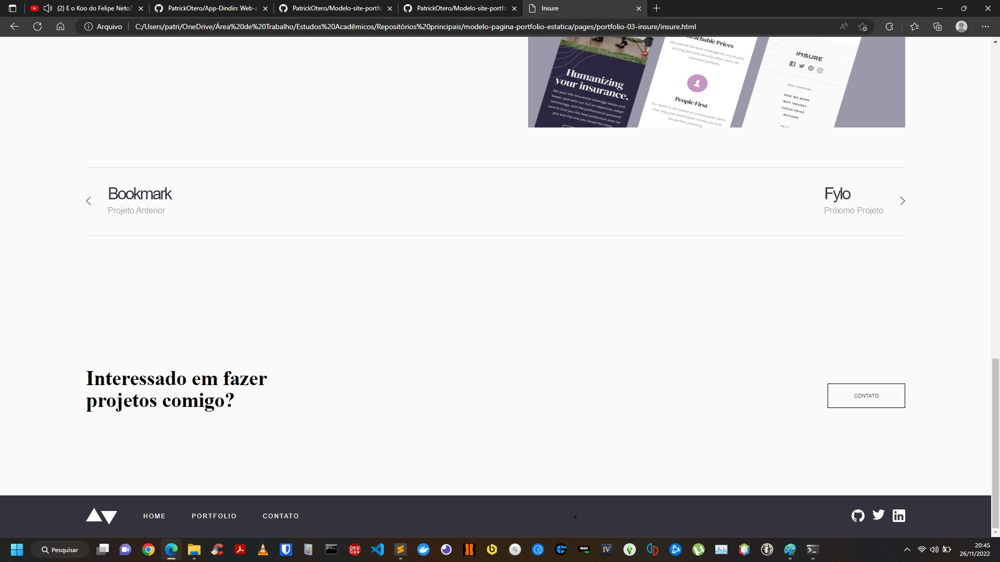

## Página "Fylo"

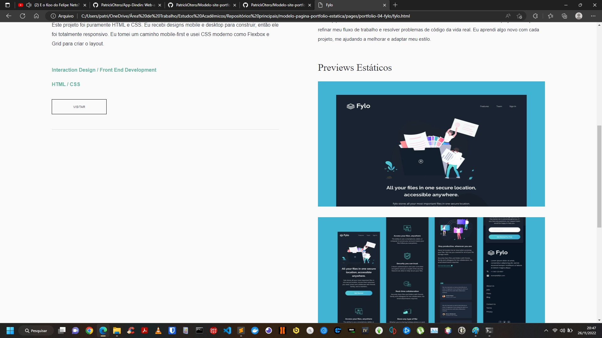
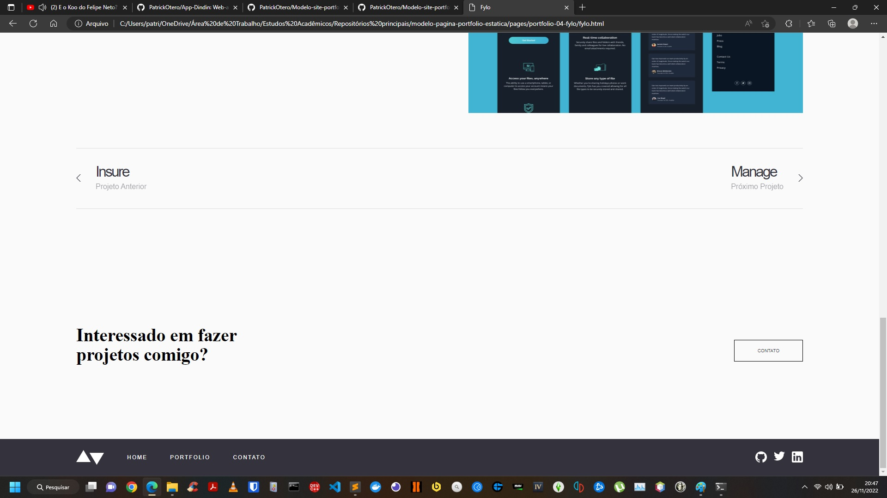